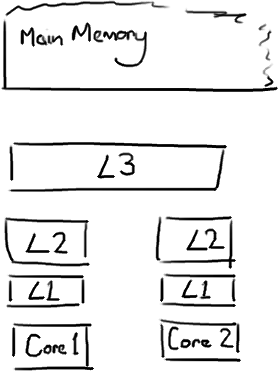

## 缓存行对齐

### CPU缓存

执行程序是靠CPU执行主存中代码，但是CPU和主存的速度差异是非常大的，为了降低这种差距，在架构中使用了CPU缓存，现在的计算机架构中普遍使用了缓存技术。常见一级缓存、二级缓存、三级缓存，这些缓存的数据获取访问速度如下：

| **从CPU到**                               | **大约需要的 CPU 周期** | **大约需要的时间** |
| ----------------------------------------- | ----------------------- | ------------------ |
| 主存                                      |                         | 约60-80纳秒        |
| QPI 总线传输 (between sockets, not drawn) |                         | 约20ns             |
| L3 cache                                  | 约40-45 cycles,         | 约15ns             |
| L2 cache                                  | 约10 cycles,            | 约3ns              |
| L1 cache                                  | 约3-4 cycles,           | 约1ns              |
| 寄存器                                    | 1 cycle                 |                    |

如果要了解缓存，就必须要了解缓存的结构，以及多个 CPU 核心访问缓存存在的一些问题和注意事项。



每个缓存里面都是由缓存行组成的，缓存系统中以缓存行（cache line）为单位存储的。缓存行大小是 64 字节。由于缓存行的特性，当多线程修改互相独立的变量时，如果这些变量共享同一个缓存行，就会无意中影响彼此的性能，这就是伪共享（下面会介绍到）。有人将伪共享描述成无声的性能杀手，因为从代码中很难看清楚是否会出现伪共享问题。

需要注意，数据在缓存中不是以独立的项来存储的，它不是我们认为的一个独立的变量，也不是一个单独的指针，它是有效引用主存中的一块地址。一个 Java 的 long 类型是 8 字节，因此在一个缓存行中可以存 8 个 long 类型的变量。

缓存行的这种特性也决定了在访问同一缓存行中的数据时效率是比较高的。比如当你访问java中的一个 long 类型的数组，当数组中的一个值被加载到缓存中，它会额外加载另外 7 个，因此可以非常快速的遍历这个数组。实际上，你可以非常快速的遍历在连续的内存块中分配的任意数据结构。

### 伪共享问题

处理器为了提高处理速度，不直接和内存进行通讯，而是先将系统内存的数据读到内部缓存（L1，L2，L3）后再进行操作，但操作完之后不知道何时会写到内存；如果对声明了 volatile 变量进行写操作，JVM 就会向处理器发送一条 Lock 前缀的指令，将这个变量所在的缓存行的数据写回到系统内存。但就算写回到内存，如果其他处理器缓存的值还是旧的，再执行计算操作就会有问题，所以在多处理器下，为了保证各个处理器的缓存是一致的，就会实现缓存一致性协议，每个处理器通过嗅探在总线上传播的数据来检查自己缓存的值是不是过期了，当处理器发现自己缓存行对应的内存地址被修改，就会将当前处理器的缓存行设置成无效状态，当处理器要对这个数据进行修改操作的时候，会强制重新从系统内存里把数据读取到处理器缓存里。

为了说明伪共享问题，下面举一个例子进行说明：两个线程分别对两个变量（刚好在同一个缓存航）分别进行读写的情况分析。


在 core1 上线程需要更新变量X,同时 core2 上线程需要更新变量 Y。这种情况下，两个变量就在同一个缓存行中。每个线程都要去竞争缓存行的所有权来更新对应的变量。如果 core1 获得了缓存行的所有权，那么缓存子系统将会使 core2 中对应的缓存失效。相反，如果 core2 获得了所有权然后执行更新操作，core1 就要使自己对应的缓存行失效。这里需要注意：整个操作过程是以缓存行为单位进行处理的，这会来来回回的经过L3缓存，大大影响了性能，每次当前线程对缓存行进行写操作时，内核都要把另一个内核上的缓存块无效掉，并重新读取里面的数据。如果相互竞争的核心位于不同的插槽，就要额外横跨插槽连接，效率可能会更低。

### 缓存行对齐

基于以上问题的分析，在一些情况下，比如会频繁进行操作的数据，可以根据缓存行的特性进行缓存行对齐（即将要操作的数据凑一个缓存行进行操作）下面使用一个示例进行说明：

```java
package com.example.demo;
 
public class Cacheline_nopadding {
    public static class T{
        //8字节
        private volatile long x = 0L;
    }
    private static T[] arr = new T[2];
 
    static {
        arr[0] = new T();
        arr[1] = new T();
    }
 
    public static void main(String[] args) throws InterruptedException {
        Thread thread1 = new Thread(()->{
            for(long i = 0;i < 1000_0000L;i++){
                //volatile的缓存一致性协议MESI或者锁总线，会消耗时间
                arr[0].x = i;
            }
        });
 
        Thread thread2 = new Thread(()->{
            for(long i = 0;i< 1000_0000L;i++){
                arr[1].x = i;
            }
        });
        long startTime = System.nanoTime();
        thread1.start();
        thread2.start();
        thread1.join();
        thread2.join();
        System.out.println("总计消耗时间："+(System.nanoTime()-startTime)/100_000);
    }
}
```
最终运行结果如下：

> 总计消耗时间：3381

下面来做一个改造升级，对齐缓存行，重点代码如下

```java
    private static class Padding{
        //7*8字节
        public volatile long p1,p2,p3,p4,p5,p6,p7;
    }
    public static class T extends Padding{
        //8字节
        private volatile long x = 0L;
    }
```

通过上述代码做缓存对齐，每次都会有初始的7*8个占位，加上最后一个就是独立的一块缓存行，整理后代码如下：

```java
package com.example.demo;
 
public class Cacheline_padding {
    private static class Padding{
        //7*8字节
        public volatile long p1,p2,p3,p4,p5,p6,p7;
    }
    public static class T extends Padding{
        //8字节
        private volatile long x = 0L;
    }
    private static T[] arr = new T[2];
 
    static {
        arr[0] = new T();
        arr[1] = new T();
    }
 
    public static void main(String[] args) throws InterruptedException {
        Thread thread1 = new Thread(()->{
            for(long i = 0;i < 1000_0000L;i++){
                //volatile的缓存一致性协议MESI或者锁总线，会消耗时间
                arr[0].x = i;
            }
        });
 
        Thread thread2 = new Thread(()->{
            for(long i = 0;i< 1000_0000L;i++){
                arr[1].x = i;
            }
        });
        long startTime = System.nanoTime();
        thread1.start();
        thread2.start();
        thread1.join();
        thread2.join();
        System.out.println("总计消耗时间："+(System.nanoTime()-startTime)/100_000);
    }
}
```

运行结果如下：

> 总计消耗时间：1428

从上面可以看到，使用缓存对齐，相同操作情况下对齐后的时间比没对齐的时间减少一半。

上面这种缓存行填充的方法在早期是比较流行的一种解决办法，比较有名的Disruptor框架就采用了这种解决办法提高性能，Disruptor是一个线程内通信框架，用于线程里共享数据。与LinkedBlockingQueue类似，提供了一个高速的生产者消费者模型，广泛用于批量IO读写，在硬盘读写相关的程序中应用十分广泛，Apache旗下的HBase、Hive、Storm等框架都有使用Disruptor。

